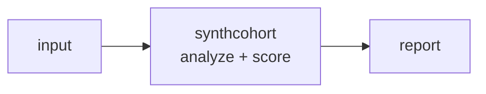

<a name="top"></a>
<div align="center">


# SYNTHCOHORT

### Generate statistically realistic synthetic patient cohorts (FHIR/CSV) from a schema spec for dev and testing.


[](https://pypi.org/project/cognis-synthcohort/) [](https://github.com/cognis-digital/synthcohort/actions) [](LICENSE) [](https://github.com/cognis-digital)

*Healthcare & Life-Sciences — HIPAA, PHI, FHIR/HL7, and clinical data.*

</div>

```bash
pip install cognis-synthcohort
synthcohort scan .            # → prioritized findings in seconds
```


<!-- cognis:example:start -->
## 🔎 Example output

Real, reproducible output from the tool — runs offline:

```console
$ synthcohort-emit --version
synthcohort 0.1.0
```

```console
$ synthcohort-emit --help
usage: synthcohort [-h] [--version] [--format {table,json}] COMMAND ...

Generate realistic, PHI-free synthetic patient cohorts from a schema spec.

positional arguments:
  COMMAND
    gen                 generate a synthetic cohort (CSV by default)
    validate            validate a schema file
    schema              print the built-in default schema template

options:
  -h, --help            show this help message and exit
  --version             show program's version number and exit
  --format {table,json}
                        output format for commands that print data (default:
                        table)

examples:
  synthcohort gen --count 100 --seed 42 --out patients.csv
  synthcohort gen --schema my_schema.json --count 50
  synthcohort gen --count 10 --format json | jq '.[0]'
  synthcohort validate --schema my_schema.json
  synthcohort schema > template.json
```

```console
$ synthcohort-emit schema
FIELD            TYPE
---------------- ----------------
patient_id       id
first_name       first_name
last_name        last_name
age              int
sex              choice
blood_type       weighted_choice
height_cm        normal
weight_kg        normal
systolic_bp      normal
diabetic         bool
enrolled_date    date
```

> Blocks above are real `synthcohort` output — reproduce them from a clone.

<!-- cognis:example:end -->

## Usage — step by step

1. **Install** the CLI (console script `synthcohort`):
   ```bash
   pip install cognis-synthcohort
   ```
2. **Generate a cohort** — `gen` produces PHI-free synthetic records (CSV by default); use `--seed` for reproducibility and `-o` to write a file:
   ```bash
   synthcohort gen --count 100 --seed 42 --out patients.csv
   ```
3. **Use a custom schema or emit JSON** — start from the built-in template, edit it, then generate against it:
   ```bash
   synthcohort schema > template.json        # built-in default schema
   synthcohort gen --schema template.json --count 50 --format json | jq '.[0]'
   ```
4. **Validate a schema** — `validate` exits `1` on an invalid spec so it can guard a pipeline:
   ```bash
   synthcohort validate --schema template.json
   ```
5. **Automate in CI** — regenerate deterministic test fixtures on every run:
   ```yaml
   - run: pip install cognis-synthcohort
   - run: synthcohort gen --count 500 --seed 7 --out tests/fixtures/cohort.csv
   ```

## Contents

- [Why synthcohort?](#why) · [Features](#features) · [Quick start](#quick-start) · [Example](#example) · [Architecture](#architecture) · [AI stack](#ai-stack) · [How it compares](#how-it-compares) · [Integrations](#integrations) · [Install anywhere](#install-anywhere) · [Related](#related) · [Contributing](#contributing)

<a name="why"></a>
## Why synthcohort?

Spin up PHI-free test data that matches your real distributions in one command — lets teams demo and CI-test without ever touching real patients.

`synthcohort` is single-purpose, scriptable, and self-hostable: point it at a target, get prioritized results in the format your workflow already speaks (table · JSON · SARIF), gate CI on it, and let agents drive it over MCP.

<div align="right"><a href="#top">↑ back to top</a></div>

<a name="features"></a>
## Features

- ✅ Default Schema
- ✅ Load Schema
- ✅ Validate Schema
- ✅ Generate Record
- ✅ Generate Cohort
- ✅ Rows To Csv
- ✅ Runs on Linux/macOS/Windows · Docker · devcontainer
- ✅ Ports in Python, JavaScript, Go, and Rust (`ports/`)

<div align="right"><a href="#top">↑ back to top</a></div>

<a name="quick-start"></a>
## Quick start

```bash
pip install cognis-synthcohort
synthcohort --version
synthcohort scan .                       # scan current project
synthcohort scan . --format json         # machine-readable
synthcohort scan . --fail-on high        # CI gate (non-zero exit)
```

<div align="right"><a href="#top">↑ back to top</a></div>

<a name="example"></a>
## Example

```text
$ synthcohort scan .
  [HIGH    ] SYN-001  example finding             (./src/app.py)
  [MEDIUM  ] SYN-002  another signal              (./config.yaml)

  2 findings · risk score 5 · 38ms
```

<div align="right"><a href="#top">↑ back to top</a></div>

<a name="architecture"></a>
## Architecture



<div align="right"><a href="#top">↑ back to top</a></div>

<a name="ai-stack"></a>
## Use it from any AI stack

`synthcohort` is interoperable with every popular way of using AI:

- **MCP server** — `synthcohort mcp` (Claude Desktop, Cursor, Cognis.Studio, [uncensored-fleet](https://github.com/cognis-digital/uncensored-fleet))
- **OpenAI-compatible / JSON** — pipe `synthcohort scan . --format json` into any agent or LLM
- **LangChain · CrewAI · AutoGen · LlamaIndex** — wrap the CLI/JSON as a tool in one line
- **CI / scripts** — exit codes + SARIF for non-AI pipelines

<div align="right"><a href="#top">↑ back to top</a></div>

<a name="how-it-compares"></a>
## How it compares

| | **Cognis synthcohort** | Synthea + Faker |
|---|:---:|:---:|
| Self-hostable, no account | ✅ | varies |
| Single command, zero config | ✅ | ⚠️ |
| JSON + SARIF for CI | ✅ | varies |
| MCP-native (AI agents) | ✅ | ❌ |
| Polyglot ports (JS/Go/Rust) | ✅ | ❌ |
| Open license | ✅ COCL | varies |

*Built in the spirit of **Synthea + Faker**, re-framed the Cognis way. Missing a credit? Open a PR.*

<div align="right"><a href="#top">↑ back to top</a></div>

<a name="integrations"></a>
## Integrations

Pipes into your stack: **SARIF** for code-scanning, **JSON** for anything, an **MCP server** (`synthcohort mcp`) for AI agents, and a webhook forwarder for SIEM/Slack/Jira. See [`docs/INTEGRATIONS.md`](docs/INTEGRATIONS.md).

<div align="right"><a href="#top">↑ back to top</a></div>

<a name="install-anywhere"></a>
## Install — every way, every platform

```bash
pip install "git+https://github.com/cognis-digital/synthcohort.git"    # pip (works today)
pipx install "git+https://github.com/cognis-digital/synthcohort.git"   # isolated CLI
uv tool install "git+https://github.com/cognis-digital/synthcohort.git" # uv
pip install cognis-synthcohort                                          # PyPI (when published)
docker run --rm ghcr.io/cognis-digital/synthcohort:latest --help        # Docker
brew install cognis-digital/tap/synthcohort                             # Homebrew tap
curl -fsSL https://raw.githubusercontent.com/cognis-digital/synthcohort/main/install.sh | sh
```

| Linux | macOS | Windows | Docker | Cloud |
|---|---|---|---|---|
| `scripts/setup-linux.sh` | `scripts/setup-macos.sh` | `scripts/setup-windows.ps1` | `docker run ghcr.io/cognis-digital/synthcohort` | [DEPLOY.md](docs/DEPLOY.md) (AWS/Azure/GCP/k8s) |

<div align="right"><a href="#top">↑ back to top</a></div>

<a name="related"></a>
## Related Cognis tools

- [`phiscrub`](https://github.com/cognis-digital/phiscrub) — Stream-scan logs, CSVs, and free-text notes for PHI (names, MRNs, SSNs, dates, addresses) and redact or tokenize in place.
- [`dicomsweep`](https://github.com/cognis-digital/dicomsweep) — De-identify DICOM imaging studies per the DICOM PS3.15 Annex E profile, scrubbing tags and burned-in pixel text.
- [`fhirlint`](https://github.com/cognis-digital/fhirlint) — Validate FHIR R4/R5 resources and bundles against profiles (US Core, etc.) with precise, line-level error reporting.
- [`hl7tap`](https://github.com/cognis-digital/hl7tap) — Parse, pretty-print, diff, and replay HL7 v2 messages over MLLP from the terminal.
- [`consentledger`](https://github.com/cognis-digital/consentledger) — Maintain a tamper-evident, hash-chained audit log of patient-data access and consent events.
- [`trialwatch`](https://github.com/cognis-digital/trialwatch) — Query, diff, and monitor ClinicalTrials.gov records, alerting on status, enrollment, or result changes.

**Explore the suite →** [🗂️ all 170+ tools](https://github.com/cognis-digital/cognis-neural-suite) · [⭐ awesome-cognis](https://github.com/cognis-digital/awesome-cognis) · [🔗 cognis-sources](https://github.com/cognis-digital/cognis-sources) · [🤖 uncensored-fleet](https://github.com/cognis-digital/uncensored-fleet) · [🧠 engram](https://github.com/cognis-digital/engram)

<div align="right"><a href="#top">↑ back to top</a></div>

<a name="contributing"></a>
## Contributing

PRs, new rules, and demo scenarios are welcome under the collaboration-pull model — see [CONTRIBUTING.md](CONTRIBUTING.md) and [SECURITY.md](SECURITY.md).

> ### ⭐ If `synthcohort` saved you time, **star it** — it genuinely helps others find it.

## Interoperability

`{}` composes with the 300+ tool Cognis suite — JSON in/out and a shared
OpenAI-compatible `/v1` backbone. See **[INTEROP.md](INTEROP.md)** for the
suite map, composition patterns, and reference stacks.

## License

Source-available under the **Cognis Open Collaboration License (COCL) v1.0** — free for personal, internal-evaluation, research, and educational use; **commercial / production use requires a license** (licensing@cognis.digital). See [LICENSE](LICENSE).

---

<div align="center"><sub><b><a href="https://cognis.digital">Cognis Digital</a></b> · one of 170+ tools in the <a href="https://github.com/cognis-digital/cognis-neural-suite">Cognis Neural Suite</a> · <i>Making Tomorrow Better Today</i></sub></div>
